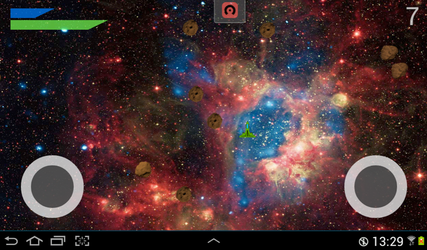
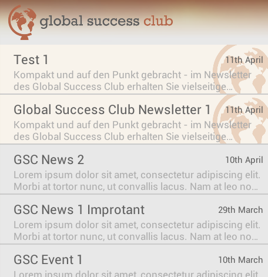
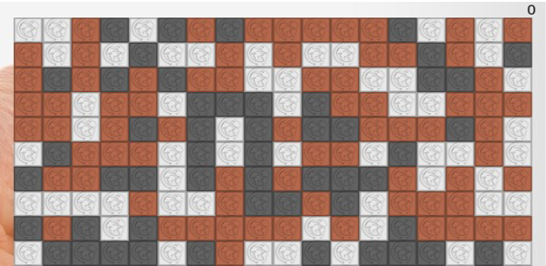

## Kickr (2014)
Android App to find football grounds, events on those grounds, organise events and add new events. To easily find people to play football with. A social network for casual football players.

Source Code not available due to planned commercial usage.

[Explanation](kickr)

### My Responsibilities
- Java/Android programming
- Mockups
- Icons/Images

### Technologies
- Java
- PHP (REST API)
- MySQL

## Asteroid Shooter (2013)

A small multi- and single-player Android game.

### My Responsibilities
- everything

### Technologies
- Java

[Source](asteroidshooter)

## News Feed (2013)

A simple news feed widget for Android.

### My Responsibilities
- everything

### Technologies
- Java

[Source](newsfeed)

## Same Game (2013)

A [SameGame](https://en.wikipedia.org/wiki/SameGame) implementation for Android and iOS.

### My Responsibilities
- Programming

### Technologies
- Java (Android)
- Objective-C (iOS)

[Source Android](samegame_android) | [Source iOS](samegame_ios)