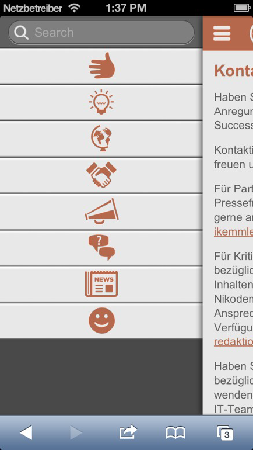
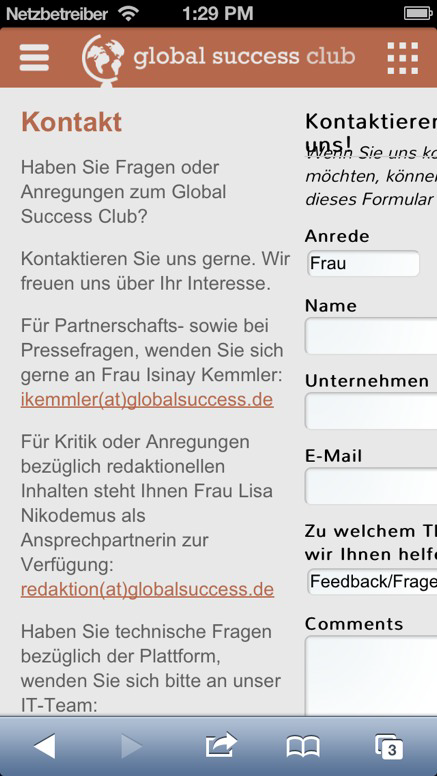

## AudioWorks (2017)
Small library to record, edit and visualise audio files in a Web Browser. Short explanation on the Live Demo site.

### My Responsibilities
- everything

### Technologies
- javascript

[Source](audioworks) | [Live Demo](http://masshiro.bplaced.net/audioworks/)

## THM Timetable (2015)
Because of the lack of a public API, and the unwillingness to provide one by the university, to retrieve timetable, teacher and module information, a timetable parser was programmed. it parses informations from html and pdf documents and provides that information in a readable and easily parsable form, either json or xml.

### My Responsibilities
- everything

### Technologies
- [ganon](https://code.google.com/archive/p/ganon/)
- smalot pdfparser
- php
- javascript/jquery
- json, xml

[Explanation](thmt) | [Live Demo Parser](http://comp.judging.it/test/thmt/) | [Live Demo Example Usage](http://comp.judging.it/test/thmt-test/)

## Japan (2014)
A Web Based Training (WBT) webpage about traveling to japan.

[Source](japan) | [Live Demo](http://masshiro.bplaced.net/japan/)

### My Responsibilities
- javascript/jquery parts
- Quiz template, function and implementation
- Parts of styling

### Technologies
- javascript/jquery
- less
- PHP
- Bootstrap
- HTML/CSS

## THM Organizer (2014)
Web App to organise ones own courses and modules. An Admin view to add new modules and courses and related information.

The source code is not available since it's a closed source App from the university.

A Live Demo of a revised version can be found below, though all functions are still the same. Edit functions are only available for registered users.

[Explanation](thm_organizer) | [Live Demo](https://www.thm.de/organizer/curricula/fb-06-mni/curriculum-inf-ms-2010.html)

### My Responsibilities
- javascript/jquery
- HTML/CSS

### Technologies
- Joomla
- PHP
- javascript
- HTML/CSS

## ECMA (2015)
Ten small projects for the [ESA course](http://www.cilie.org/esa/).

### My Responsibilities
- everything

### Technologies
- javascript

[Source](ecma) | [Live Demo](http://masshiro.bplaced.net/ecma/)

## Portfolio Bachelor (2013)
Portfolio for bachelor internship application.

### My Responsibilities
- everything

### Technologies
- javascript
- HTML/CSS

[Source](portfolio_bachelor) | [Live Demo](http://masshiro.bplaced.net/portfolio/)

## Mathematikum (2011)
A wiki like maths platform with its own markup language.

### My Responsibilities
- PHP programming
- Design
- Markup language

### Technologies
- PHP
- MySQL
- javascript
- HTML/CSS

[Source](mathematikum) | [Live Demo](http://masshiro.bplaced.net/portfolio/projects/semester2/mathematikum/) | [Manual](http://masshiro.bplaced.net/portfolio/projects/semester2/mathematikum/tut.mp4)

## EPub Reader (2012)
A Platform for ePub documents. One can upload ePubs and share them. ePubs are being parsed and processed for preview in a web browser.

### My Responsibilities
- PHP programming
- ePub Parser

### Technologies
- PHP
- javascript/jquery
- HTML/CSS

[Source](ePub) | [ReadMe](http://masshiro.bplaced.net/portfolio/projects/semester4/epub/ReadMe.html) | [Live Demo](http://masshiro.bplaced.net/portfolio/projects/semester4/epub/ePub/index.php?id=d57306a4c8bcb4f9b5687caa9ca98d4d) | [Live Demo Admin](http://masshiro.bplaced.net/portfolio/projects/semester4/epub/ePub/admin.php) Password: admin

## Mobile Theme Liferay (2013)

A mobile theme for a web page and Liferay.

No source availablecommecial due to commercial usage.

### My Responsibilities
- programming
- design

### Technologies
- Liferay
- javascript/jquery
- HTML/CSS
