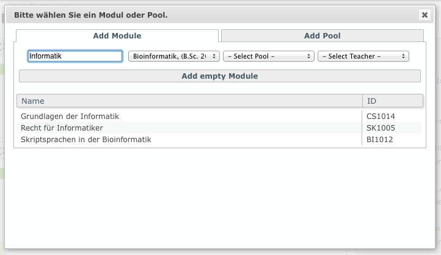

# THM Orgnaizer
Das Curriculum repräsentiert den Aufbau eines Programms (Studiengang). Ein Studiengang kann aus mehreren Pools (Semestern) bestehen, dem wiederum mehrere Module (Fächer) oder Pools zugeordnet sein können. In einer Bearbeitungs-Ansicht können alle relevanten Daten einfach und intuitive bearbeitet werden.

### THM-Organizer Curriculum Bearbeitungs-Ansicht

# Programm Buttons 
## Edit Button 

**Bearbeiten (Notizblock), Hinzufügen (Plus), Speichern (Diskette), Abbrechen (Kreuz)**

Diesen Button müssen sie drücken wenn Sie das Curriculum editieren wollen. Sie sehen diesen Button allerdings nur wenn Sie die Berechtigung haben das Curriculum zu editieren. Wenn dieser Buttons gedrückt wird, werden alle anderen Bearbeitungs-Buttons sichtbar.

## Hinzufügen Button 
Wenn Sie auf diesen Button Klicken wird ein neuer Pool ans Ende des Curriculum gehängt.

## Speichern Button 
Wenn Sie auf diesen Button Klicken werden alle Änderungen unwiderruflich gespeichert.

## Abbrechen Button 
Dieser Button ist zum zurücksetzten der Änderungen, klicken Sie ihn und alle Ihrer Änderungen sind unwiderruflich zurückgesetzt

# Pool Buttons

**Neu (Plus), Edit (Notizblock), Löschen (Mülleimer), Oben (Pfeil nach oben), Unten (Pfeil nach unten)**

## Hinzufügen Button 
Dieser Button fügt eine neues Modul oder Pool zu einem vorhandenem Pool hinzu.

## Edit Button 
Dieser Button macht das editieren der Pool Daten möglich. Dies beinhaltet den Namen, die Beschreibung, die minimalen CrP und die maximalen CrP. Macht den Akzeptieren Button sichtbar.

## Akzeptieren Button 

**[Pool, Akzeptieren (Häckchen)**

Dieser Button akzeptiert die Änderungen an einem Pool. Nur sichtbar wenn Pool editiert wird.

## Löschen Button 
Dieser Button löscht einen kompletten Pool.

## Pfeil nach unten Button 
Dieser Button verschiebt einen Pool eine Stelle nach unten.

## Pfeil nach oben Button 
Dieser Button verschiebt einen Pool eine Stelle nach oben.

# Modul Buttons 

**Ändern (Glühbirne), Löschen (Mülleimer)**

Diesen Buttons werden angezeigt wenn über in Modul oder Pool im Pool gehovert wird.
## Feld ändern Button 
Dieser Button ändert den Bereich zu dem ein Modul zugeordnet ist.

## Löschen Button 
Dieser Button löscht ein Modul aus einem Pool.

# Modul und Pool hinzufügen Dialog 
Dieser Dialog listet Module beziehungsweise Pools die hinzugefügt werden können. Mit einem klick auf das jeweilige Listenelement wird dieses zu einem Pool hinzugefügt.

## Modul Suchen Feld 

**Filter in Modulliste**

Mit diesem Feld kann die aktuelle Liste nach einem Begriff gefiltert werden. Es wird nach Name und ID gesucht.

## Modul Programm Drop Down Menü 
In diesem Feld kann die Liste nach einem spezifischen Programm gefiltert werden.

## Modul Pool Drop Down Menü 

In diesem Feld kann die Liste nach einem spezifischen Pool eines Programms gefiltert werden.

## Modul Lehrer Drop Down Menü 
In diesem Feld kann die Liste nach einem spezifischen Lehrer gefiltert werden.

## Leeres Modul hinzufügen Button 
Mit diesem Buttons kann man ein Leeres Modul zu einem Pool hinzufügen. Dies wird als Spacer benötigt.

## Pool Suchen Feld 
Mit diesem Feld kann die aktuelle Liste nach einem Begriff gefiltert werden. Es wird nach dem Namen gesucht.

## Pool Programm Drop Down Menü 

In diesem Feld kann die Liste nach einem spezifischen Programm gefiltert werden.

## Leeren Pool hinzufügen Button 
Mit diesem Buttons kann man ein Leeres Modul zu einem Pool hinzufügen. Dies wird als Spacer benötigt. Momentan noch keine Funktion da Inline-Pools nicht implementiert.

## "pools": {} 
hier befinden sich alle Pools die neu erstellt wurden oder verschoben wurden, sowie dessen Child-Elements.

## "poolPool": {} 
Hier finden sich alle Subjects die verschoben wurden oder dessen Kompetenz sich verändert haben, allerdings nur wenn sich deren Parent-Elements nicht geändert haben.

## "subjects": {} 
Hier finden sich alle Subjects die verschoben wurden oder dessen Kompetenz sich verändert haben, allerdings nur wenn sich deren Parent-Elements nicht geändert haben.

## "poolsChange": {} 
Hier befinden sich alle Pools dessen Name, Beschreibung oder CrP’s sich verändert haben

## "1": {}, "2": {}, ... 
Auflistung der Elemente in der jeweiligen Sektion.

## "type": 
Gibt den Backend an welche Aktion durchgeführt werden soll, es gibt "CRE" – ein neues Element soll erstellt werden, "UPD" – ein vorhandenes Element soll verschoben oder neu hinzugefügt werden, "DEL" – ein Element soll gelöscht werden, “FIE” – ein Kompetenzbereich bzw. ein Field soll geändert werden.

## "children": {} 
Hier werden die Child-Elemente, also Pools und Subjects aufgelistet.
